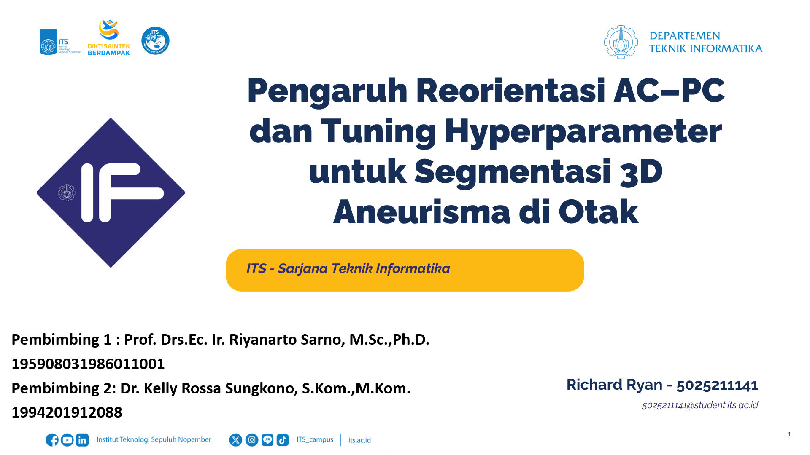

# 🏁 Tugas Akhir (TA) - Final Project

**Nama Mahasiswa**: Richard Ryan  
**NRP**: 5025211141  
**Judul TA**: Pengaruh Reorientasi Anterior Commisure – Posterior Commisure dan Tuning Hyperparameter untuk Kasus Segmentasi 3D Aneurisma di Otak  
**Dosen Pembimbing**: Prof. Drs. Ec. Ir. Riyanarto Sarno, M.Sc., Ph.D.  
**Dosen Ko-pembimbing**: Dr. Kelly Rossa Sungkono


---

## 📺 Demo Aplikasi  

[](https://youtu.be/ZpgLPlfG3Do)  
*Klik gambar di atas untuk menonton demo*

## 🛠 Panduan Instalasi & Menjalankan Software  

### Prasyarat  
- Python 3.9.13

### Langkah-langkah  
1. **Clone Repository**  
   ```bash
   git clone https://github.com/Informatics-ITS/ta-RichardRyan141.git
   ```
2. **Instalasi Dependensi**
   ```bash
   cd [folder-proyek]
   pip install -r requirements.txt
   ```
3. **Download dataset**
- Registrasi dan download data dari ADAM Challenge (adam.isi.uu.nl)
4. **Jalankan Kode**
- Buka resizer.ipynb, ubah variabel yang ditunjukkan (jika perlu) dan jalankan code
- Download acpcdetect dari NITRC (https://www.nitrc.org/projects/art) kemudian jalankan untuk setiap directory kasus data
- Buka reorient.ipynb, ubah variabel yang ditunjukkan (jika perlu) dan jalankan code
- Buka generate-csv.ipynb, ubah variabel yang ditunjukkan (jika perlu) dan jalankan code
- Buka train.ipynb, ubah variabel yang ditunjukkan (jika perlu) dan jalankan code
- Buka validate.ipynb, ubah variabel yang ditunjukkan (jika perlu) dan jalankan code

---

## ⁉️ Pertanyaan?

Hubungi:
- Penulis: richard.ryan.rr0@gmail.com
- Pembimbing Utama: riyanarto@if.its.ac.id
